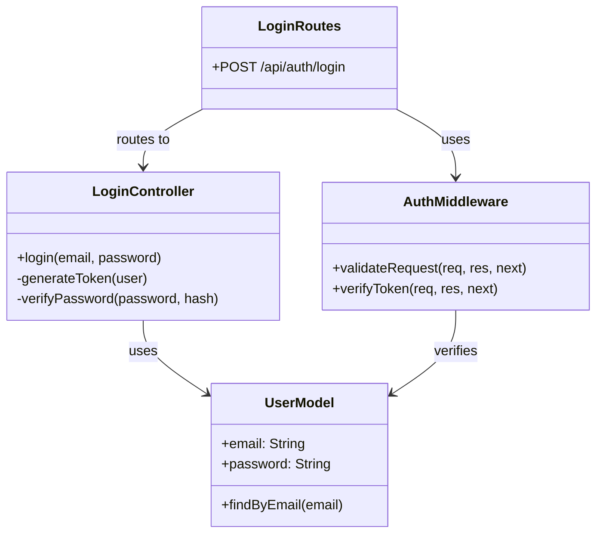
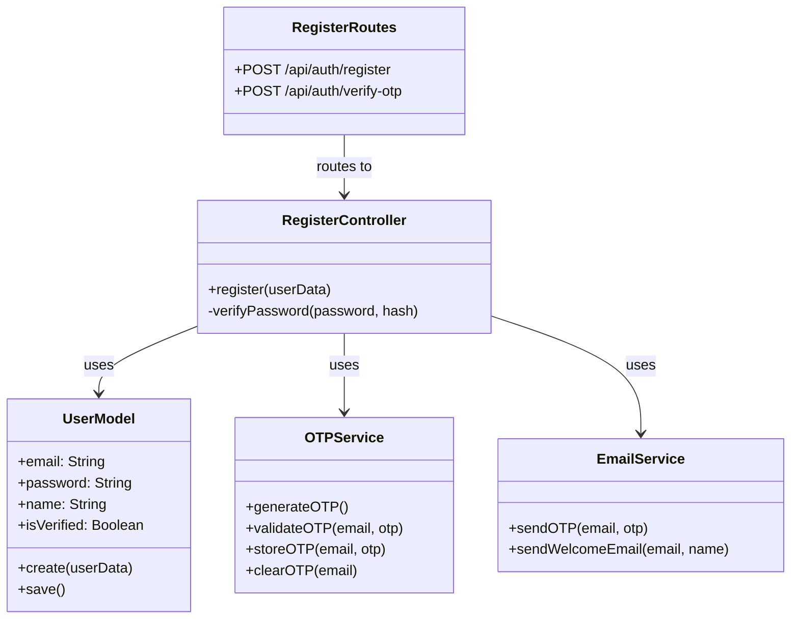
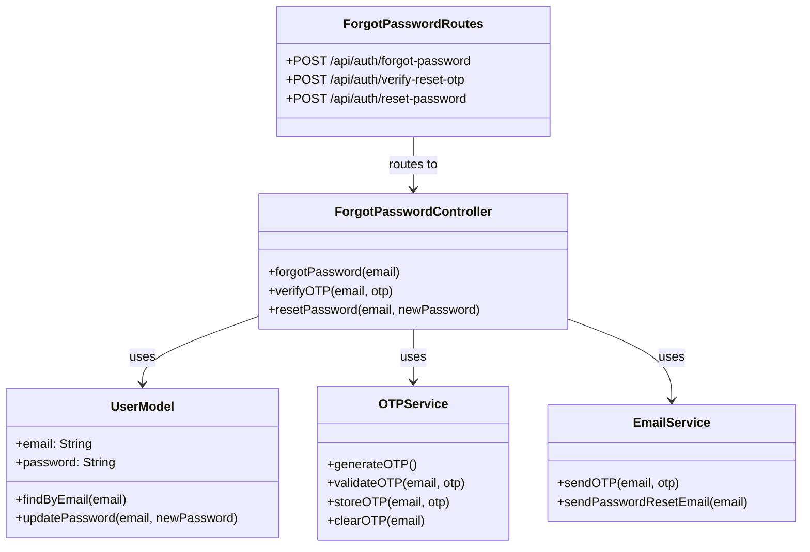

# Authentication System Class Specifications

## 1. Login System

### Login Class Specifications

#### LoginController
- **Responsibilities:**
  - Xử lý request đăng nhập
  - Tạo và xác thực JWT token
- **Methods:**
  - `login(email, password)`: Xử lý đăng nhập
  - `generateToken(user)`: Tạo JWT token
  - `verifyPassword(password, hash)`: Xác thực mật khẩu

#### UserModel (Login)
- **Properties:**
  - `email`: Email của user
  - `password`: Mật khẩu đã hash
- **Methods:**
  - `findByEmail(email)`: Tìm user theo email

#### AuthMiddleware (Login)
- **Methods:**
  - `validateRequest(req, res, next)`: Validate request
  - `verifyToken(req, res, next)`: Xác thực JWT token

#### LoginRoutes
- **Endpoints:**
  - `POST /api/auth/login`: Đăng nhập

## 2. Register System

### Register Class Specifications

#### RegisterController
- **Responsibilities:**
  - Xử lý đăng ký user mới
  - Quản lý xác thực OTP
- **Methods:**
  - `register(userData)`: Xử lý đăng ký
  - `verifyPassword(password, hash)`: Xác thực mật khẩu

#### UserModel (Register)
- **Properties:**
  - `email`: Email của user
  - `password`: Mật khẩu đã hash
  - `name`: Tên user
  - `isVerified`: Trạng thái xác thực
- **Methods:**
  - `create(userData)`: Tạo user mới
  - `save()`: Lưu thay đổi vào database

#### OTPService (Register)
- **Methods:**
  - `generateOTP()`: Tạo mã OTP mới
  - `validateOTP(email, otp)`: Xác thực OTP
  - `storeOTP(email, otp)`: Lưu OTP
  - `clearOTP(email)`: Xóa OTP sau khi sử dụng

#### EmailService (Register)
- **Methods:**
  - `sendOTP(email, otp)`: Gửi email chứa OTP
  - `sendWelcomeEmail(email, name)`: Gửi email chào mừng

#### RegisterRoutes
- **Endpoints:**
  - `POST /api/auth/register`: Đăng ký
  - `POST /api/auth/verify-otp`: Xác thực OTP

## 3. Forgot Password System

### Forgot Password Class Specifications

#### ForgotPasswordController
- **Responsibilities:**
  - Xử lý quy trình quên mật khẩu
  - Quản lý xác thực OTP và reset password
- **Methods:**
  - `forgotPassword(email)`: Khởi tạo quy trình quên mật khẩu
  - `verifyOTP(email, otp)`: Xác thực OTP
  - `resetPassword(email, newPassword)`: Đặt lại mật khẩu

#### UserModel (Forgot Password)
- **Properties:**
  - `email`: Email của user
  - `password`: Mật khẩu đã hash
- **Methods:**
  - `findByEmail(email)`: Tìm user theo email
  - `updatePassword(email, newPassword)`: Cập nhật mật khẩu

#### OTPService (Forgot Password)
- **Methods:**
  - `generateOTP()`: Tạo mã OTP mới
  - `validateOTP(email, otp)`: Xác thực OTP
  - `storeOTP(email, otp)`: Lưu OTP
  - `clearOTP(email)`: Xóa OTP sau khi sử dụng

#### EmailService (Forgot Password)
- **Methods:**
  - `sendOTP(email, otp)`: Gửi email chứa OTP
  - `sendPasswordResetEmail(email)`: Gửi email reset mật khẩu

#### ForgotPasswordRoutes
- **Endpoints:**
  - `POST /api/auth/forgot-password`: Quên mật khẩu
  - `POST /api/auth/verify-reset-otp`: Xác thực OTP
  - `POST /api/auth/reset-password`: Đặt lại mật khẩu 