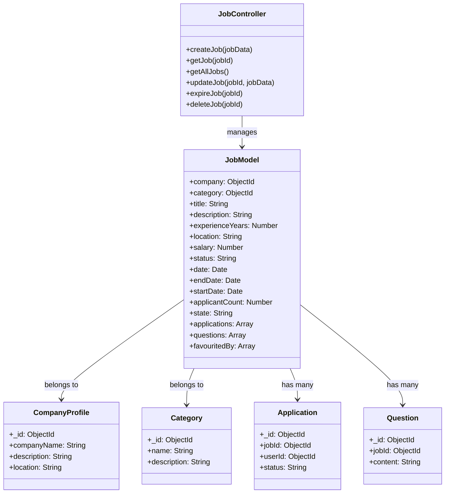
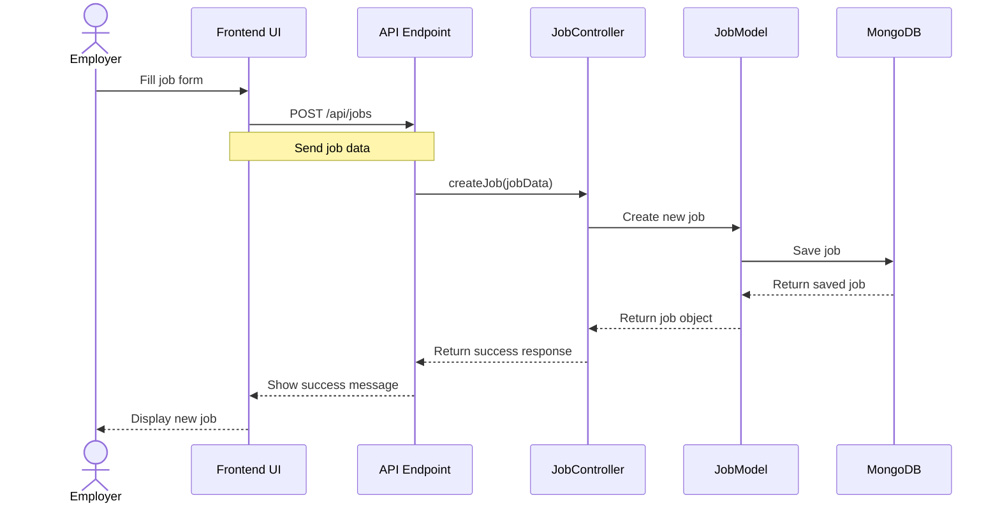
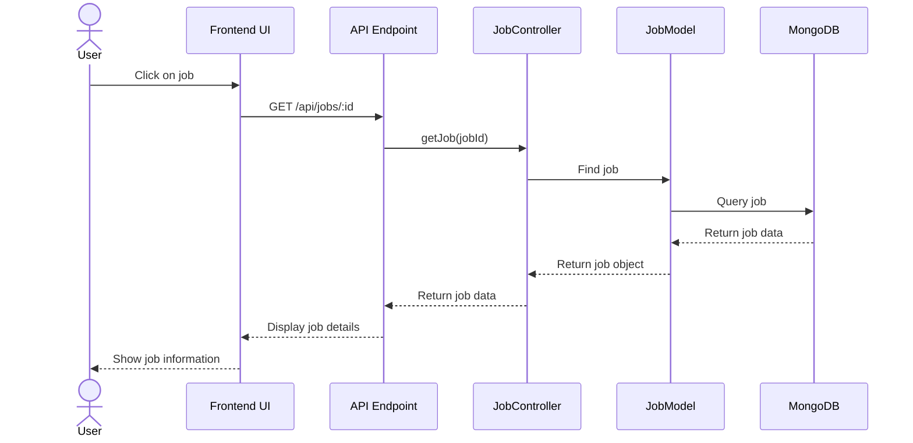
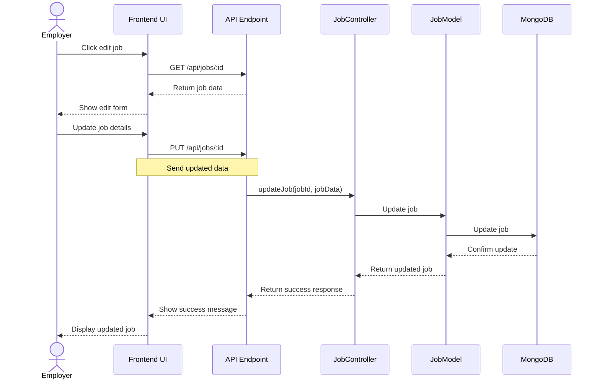
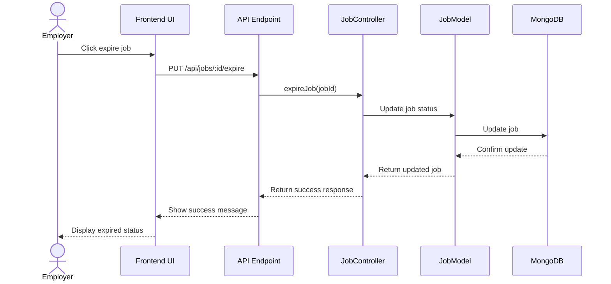

# Job Management System Specifications

## 1. Class Diagram

## 2. API Specifications

### JobController
- **Responsibilities:**
  - Handle job CRUD operations
  - Manage job status and applications
  - Process job-related requests
- **Methods:**
  - `createJob(jobData)`: Create new job posting
  - `getJob(jobId)`: Retrieve job details
  - `getAllJobs()`: List all active jobs
  - `updateJob(jobId, jobData)`: Modify job information
  - `expireJob(jobId)`: Mark job as expired
  - `deleteJob(jobId)`: Remove job posting

### JobModel
- **Properties:**
  - `company`: Company reference
  - `category`: Job category
  - `title`: Job title
  - `description`: Job description
  - `experienceYears`: Required experience
  - `location`: Job location
  - `salary`: Salary range
  - `status`: Job status
  - `date`: Posting date
  - `endDate`: Application deadline
  - `startDate`: Job start date
  - `applicantCount`: Number of applicants
  - `state`: Job state
  - `applications`: List of applications
  - `questions`: Job-related questions
  - `favouritedBy`: Users who saved the job

## 3. API Endpoints

### Create Job
- **Method:** POST
- **Endpoint:** `/api/jobs`
- **Description:** Create a new job posting
- **Request Body:** Job details
- **Response:** Created job object

### View Job
- **Method:** GET
- **Endpoint:** `/api/jobs/:id`
- **Description:** Get job details by ID
- **Response:** Job information

### Edit Job
- **Method:** PUT
- **Endpoint:** `/api/jobs/:id`
- **Description:** Update job information
- **Request Body:** Updated job details
- **Response:** Updated job object

### Expire Job
- **Method:** PUT
- **Endpoint:** `/api/jobs/:id/expire`
- **Description:** Mark job as expired
- **Response:** Updated job status

### List Jobs
- **Method:** GET
- **Endpoint:** `/api/jobs`
- **Description:** Get all active jobs
- **Query Parameters:** 
  - `category`: Filter by category
  - `location`: Filter by location
  - `status`: Filter by status
- **Response:** List of jobs

## 4. Sequence Diagrams

### Create Job

### View Job

### Edit Job

### Expire Job

### Notes:
1. **Create Job:**
   - Employer tạo job mới
   - Hệ thống validate dữ liệu
   - Lưu job vào database

2. **View Job:**
   - User xem chi tiết job
   - Hệ thống lấy thông tin từ database
   - Hiển thị đầy đủ thông tin job

3. **Edit Job:**
   - Employer chỉnh sửa job
   - Hệ thống validate dữ liệu mới
   - Cập nhật thông tin trong database

4. **Expire Job:**
   - Employer đánh dấu job hết hạn
   - Hệ thống cập nhật trạng thái
   - Job không còn hiển thị trong danh sách active 