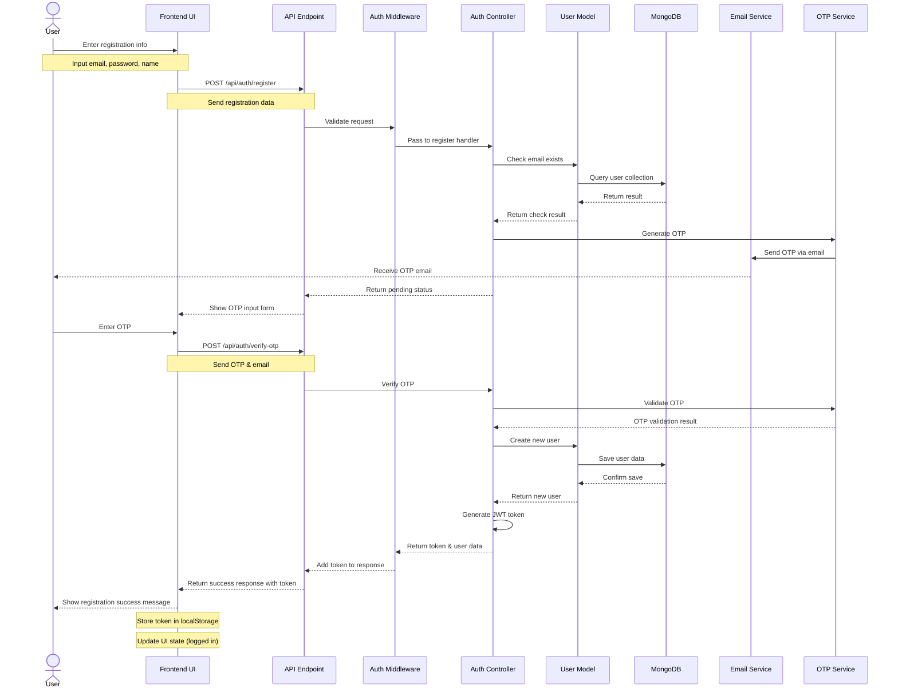

```mermaid
sequenceDiagram
    actor User
    participant UI as Frontend UI
    participant API as API Endpoint
    participant Auth as Auth Middleware
    participant Controller as Auth Controller
    participant Model as User Model
    participant DB as MongoDB
    participant Email as Email Service
    participant OTP as OTP Service

    User->>UI: Enter registration info
    Note over User,UI: Input email, password, name
    
    UI->>API: POST /api/auth/register
    Note over UI,API: Send registration data
    
    API->>Auth: Validate request
    Auth->>Controller: Pass to register handler
    
    Controller->>Model: Check email exists
    Model->>DB: Query user collection
    DB-->>Model: Return result
    Model-->>Controller: Return check result
    
    Controller->>OTP: Generate OTP
    OTP->>Email: Send OTP via email
    Email-->>User: Receive OTP email
    
    Controller-->>API: Return pending status
    API-->>UI: Show OTP input form
    
    User->>UI: Enter OTP
    UI->>API: POST /api/auth/verify-otp
    Note over UI,API: Send OTP & email
    
    API->>Controller: Verify OTP
    Controller->>OTP: Validate OTP
    OTP-->>Controller: OTP validation result
    
    Controller->>Model: Create new user
    Model->>DB: Save user data
    DB-->>Model: Confirm save
    Model-->>Controller: Return new user
    
    Controller->>Controller: Generate JWT token
    
    Controller-->>Auth: Return token & user data
    Auth-->>API: Add token to response
    API-->>UI: Return success response with token
    
    UI-->>User: Show registration success message
    Note over UI: Store token in localStorage
    Note over UI: Update UI state (logged in)
``` 